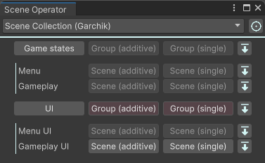

# Scene Operator

Scene management in Editor mode.

To manage scenes, you need collections, the creation of which is described below.
The path to open the editor - Tools/Scene Operator

## Customizing Collections
- Create a scene collection via AssetCreateMenu (look for the Scene Operator section).
- Add the necessary groups to the collection (e.g. UI, Game States, etc.).
- Add scenes to each group.

## Editor
- In the drop-down list of the editor, select the desired collection (if editing is necessary, there is a button to the right of the drop-down list to select the collection in the project window)
- The group is a drop-down list of scenes for loading/unloading each scene separately
- Groups can be loaded/unloaded as a whole also in additive or single modes
- If not all scenes are loaded from a group, the loading buttons are highlighted in color

